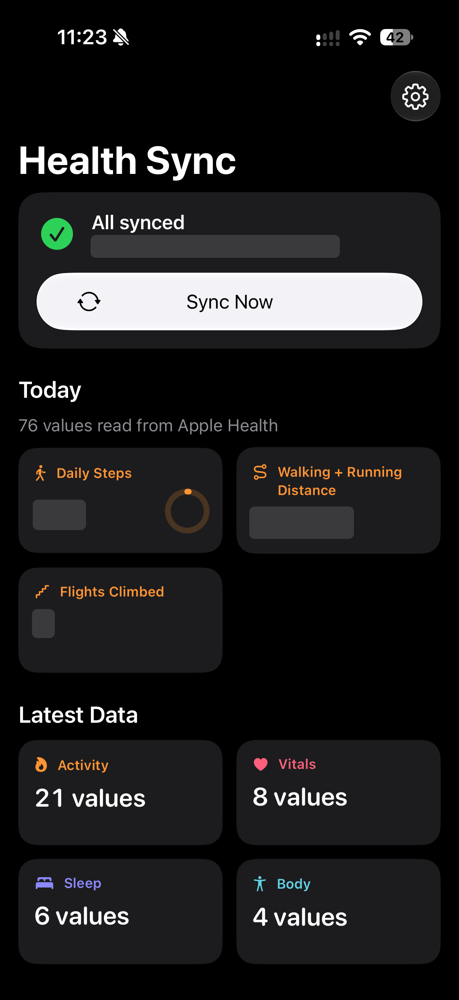
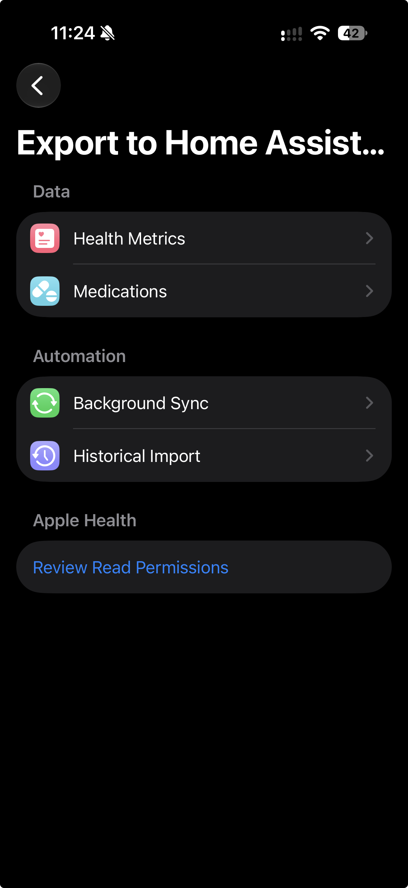
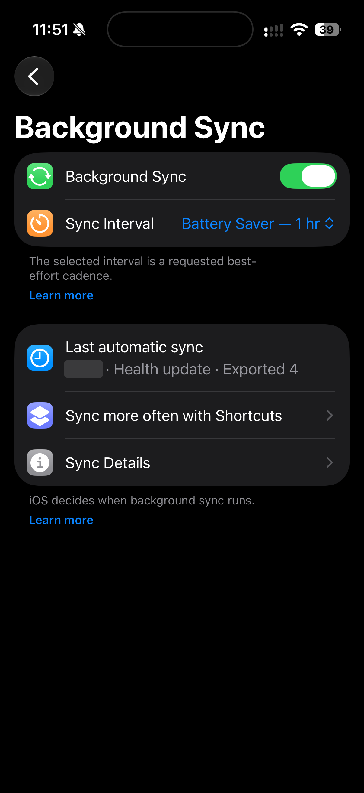
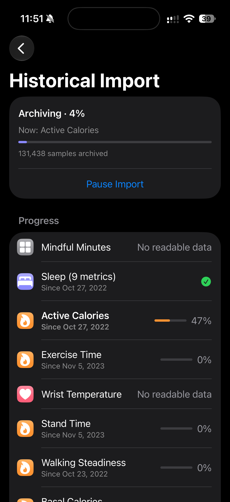

# Health Sync

Health Sync sends selected Apple Health data from your iPhone to your own [Home Assistant](https://www.home-assistant.io/) through [Health Bridge](https://github.com/allhappy-labs/Health_Bridge). Choose what iOS may share, sync on demand, or use the lifetime unlock for best-effort background and Shortcuts sync. On supported iOS and Health Bridge versions, Historical Import can archive each metric from its earliest readable HealthKit sample. The app has no account or hosted health-data service; HealthKit permissions and Home Assistant authentication remain under your control.

## In the app

These real iPhone captures show the dashboard, export settings, background sync and a full-history import in progress. Personal health readings, in-app sync timestamps, and other apps' Live Activities have been redacted. The original 1206 × 2622 resolution is retained for documentation and App Store preparation.

<p align="center">
  
  
  
  
</p>

See [What it does](#what-it-does) and [Set up the app](#set-up-the-app) for feature details and setup instructions.

## What it does

- **Free:** connect to Home Assistant, select metrics and inbound pairings, and use **Sync Now**.
- **Lifetime unlock:** enable best-effort background and Shortcuts sync plus historical import. The app displays the local App Store price and offers Restore Purchases; this is a one-time purchase, not a subscription. StoreKit/App Store availability is required for a normal purchase.
- **Historical import:** on iOS 27, a compatible Health Bridge protocol-2 fork can archive each selected metric from its earliest readable HealthKit date, including original quantity, category, and workout samples. The screen shows overall and per-type progress (the share of each type's history already confirmed by Home Assistant), what is being archived now, and a countdown while Home Assistant's per-minute upload limit pauses the import; paused imports resume where they stopped. Older iOS versions or protocol-1 servers retain the experimental latest-14-days recorder import. A Home Assistant administrator must approve this iPhone as the archive uploader before protocol-2 writes.

Background execution depends on iOS scheduling and is not guaranteed at a fixed interval. Background Sync shows the last automatic sync and warns only when iOS is blocking it (Background App Refresh off or Low Power Mode); system state, registrations and recent sync events are under **Sync Details**. HealthKit access is per type; the app imports only data that iOS makes readable. Medication data uses a separate opt-in authorization flow and is not included in the original-sample archive.

## Requirements

- iPhone with iOS 18 or newer; iOS 27 for full-history archive import.
- A Home Assistant instance with Health Bridge. The archive fork is qualified locally against Home Assistant Core 2026.9.3 / Python 3.14.2 or newer; other server versions need compatibility testing.
- A Health Bridge **Health Assistant Link** entry and its webhook secret, plus a Home Assistant long-lived access token for authenticated API requests. Keep both credentials private and separate.

The archive fork is currently a source prerelease, not a verified HACS release. Follow [its install and upgrade guide](https://github.com/allhappy-labs/Health_Bridge/blob/main/docs/archive-operations.md), including a Home Assistant backup. The upstream HACS entry supports legacy live sync but does not provide this protocol-2 archive.

## Set up the app

Step-by-step instructions, including installing Health Bridge and finding each connection value, are in **[SETUP.md](SETUP.md)**; the app links there from its Connect screen. In short:

1. Install the compatible Health Bridge fork if you want full history. Back up Home Assistant first. Add or keep a **Health Assistant Link** entry; do not recreate an existing entry just to upgrade the integration.
2. Build and install the app with Xcode until a verified App Store/TestFlight listing is available. Open the app, choose the Apple Health metrics you want, and grant their read access. Grant write access separately only if you configure Home Assistant → Apple Health pairings.
3. Enter your Home Assistant URL, Health Bridge user ID and webhook secret. Create a long-lived access token in your Home Assistant user profile and enter it in the app's separate API credential field. Test both connections, save, then tap **Sync Now**.
4. For historical import, open Settings → Export to Home Assistant → Historical Import. On iOS 27 with protocol 2, the screen shows an approval step until this iPhone is the approved archive uploader: request approval and compare the fingerprint shown there with the administrator archive card. Choose the metrics and **All readable history** only after reviewing the privacy notice (**Learn more**), then tap **Archive Readable History**. **Archive Details** shows Health Bridge compatibility, the approval state, statistics status and archive deletion help. If the screen shows the 14-day experimental import instead, the server or iOS version supports only protocol 1.

The original-sample archive is durable server data. Revoking Health access or deleting the app does **not** erase it; Home Assistant administrators and backups may retain it. See [archive operations](https://github.com/allhappy-labs/Health_Bridge/blob/main/docs/archive-operations.md) for browsing, export, backup and deletion. Protect the Home Assistant server and its backups accordingly.

## Build and test from source

Open `HAHealthSync.xcodeproj` in a current Xcode with the required iOS SDK, select your own Apple Development team, and use an app identifier and provisioning profile with HealthKit/background-delivery capabilities. The checked-in app bundle ID is `com.marynavdovenko.HAHealthSync`; use an identifier you control for your own build. Never commit tokens, provisioning profiles or signing keys.

```bash
swift test --package-path Packages/HealthSyncCore
xcodebuild build -project HAHealthSync.xcodeproj -scheme HAHealthSync \
  -destination 'generic/platform=iOS Simulator' CODE_SIGNING_ALLOWED=NO
```

The app uses Apple frameworks and its checked-in local Swift package, with no third-party Swift package download. For simulator tests, formatting and release checks, see [testing](docs/testing.md); for architecture and privacy, see [architecture](docs/architecture.md) and [privacy](docs/privacy.md).

## Project status

The protocol-2 app and fork passed local automated and disposable Home Assistant Core tests. A real iOS 27 phone-to-server archive import, target Home Assistant backup/restore, live StoreKit purchase, and App Store distribution are **not yet verified**. See the [full-history verification record](docs/full-history-archive-verification.md) and [release checklist](AppStore/release-checklist.md). Do not rely on this prerelease as the only copy of health history.

## License and upstream

Health Sync is licensed under [MIT](LICENSE). The Health Bridge fork is a separate MIT-licensed derivative of [gregt1993/Health_Bridge](https://github.com/gregt1993/Health_Bridge), preserving its upstream history and attribution. MIT permits commercial reuse and modified distributions; it does not require contributors to publish their changes.
